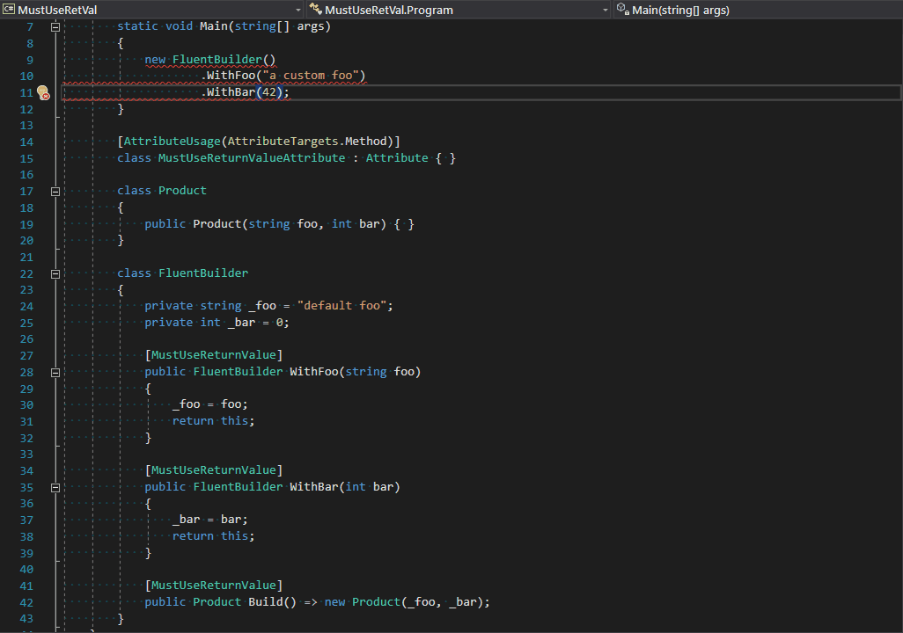

# UNDER CONSTRUCTION
This is work in progress. NuGet packages don't exist yet.  

# Emit a compile error if a method's return value is not used.
(This analyzer is based on [ReturnValueUsageAnalyzer](https://github.com/Richiban/Richiban.Analyzer/tree/master/ReturnValueUsageAnalyzer/ReturnValueUsageAnalyzer) by [Richard Gibson](https://github.com/Richiban)).

## Motivation

The motivation is to help mitigate [the finishing problem of fluent interfaces](https://daveaglick.com/posts/method-chaining-fluent-interfaces-and-the-finishing-problem).

> [...] a particular challenge of fluent interfaces and method chaining known as the “finishing problem.” To illustrate it, consider a logging framework. It might allow some number of chained methods such as Severity(), Source(), User(), CallSite(), etc.:  
>  
> `Log.Message("Oh, noes!").Severity(Severity.Bad).User("jsmith");`  
>  
> Looks nice, right? The problem here is that the logging framework doesn’t know when to write the log message to the log file.  
Do I do it in the `User()` method?  
What if I don’t use the `User()` method or I put it before the `Severity()` method, then when do I write to the file?  
This problem occurs any time you want the entire result of a method chain to take some external action other than manipulating the context of the chain.

Specifically, the analyzer makes it possible to enforce calling of the terminating method.

> ## Terminating Method
> 
> This first technique is probably one of the easier [...]  
> It requires the introduction of a method that serves to complete the chain and act on it’s final context. For example:
> 
> `Log.Message("Oh, noes!").Severity(Severity.Bad).User("jsmith").Write();`
> 
> See how we added the `Write()` method there at the end?  
> That `Write()` method takes the chain context, writes it to disk, and doesn’t return anything (effectively stopping the chain).  
>  
> So why is this so bad? For one, it would be very easy to forget the `Write()` method at the end of the chain. This technique requires the programmer to remember something that **the compiler can’t check** and that wouldn’t be picked up at runtime if they forgot.

Well, the terminating method isn't that bad anymore! As now the [MustUseRetVal](https://www.nuget.org/packages/MustUseRetVal) analyzer can emit a compile-time error if the terminating method call is missing.

## Download and install

Install the [MustUseRetVal](https://www.nuget.org/packages/MustUseRetVal) nuget package.
For example, run the following command in the [NuGet Package Manager Console](https://docs.microsoft.com/en-us/nuget/tools/package-manager-console).

```powershell
Install-Package MustUseRetVal
```
   
This will download all the binaries, and add necessary analyzer references to your project.

## How to use it?

1. Install the nuget package.
2. In the project where you installed the package add the `//[MustUseReturnValue]` comment   
   above a method the return value of which must not be ignored by the calling code.

## How does it work?

1. This analyzer looks at an invocation expression (e.g., a method call).
2. It then finds the method's definition.
3. If the definition is prefixed with a comment of the form `//[MustUseReturnValue]`,  
   the analyzer requires the method's return value must not be discarded implicitely.



## Technical details

The analyzer, code-fix provider, and tests are implemented in F#

# Thank you!

- [Richard Gibson](https://github.com/Richiban) for [ReturnValueUsageAnalyzer](https://github.com/Richiban/Richiban.Analyzer/tree/master/ReturnValueUsageAnalyzer/ReturnValueUsageAnalyzer) which [MustUseRetVal](https://github.com/mykolav/must-use-ret-val-fs) is based on.
- [John Koerner](https://github.com/johnkoerner) for [Creating a Code Analyzer using F#](https://johnkoerner.com/code-analysis/creating-a-code-analyzer-using-f/)
- [Dustin Campbell](https://github.com/DustinCampbell) for [CSharpEssentials](https://github.com/DustinCampbell/CSharpEssentials)

# License

The [MustUseRetVal](https://github.com/mykolav/must-use-ret-val-fs) analyzer and code-fix provider are licensed under the MIT license.  
So they can be used freely in commercial applications.
